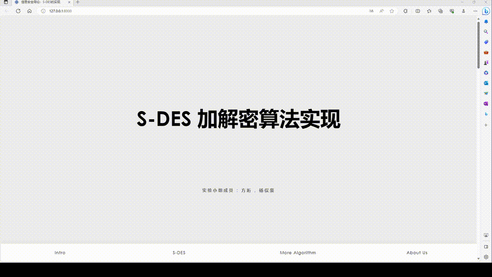
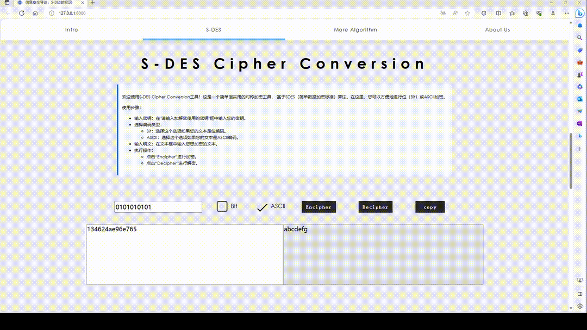
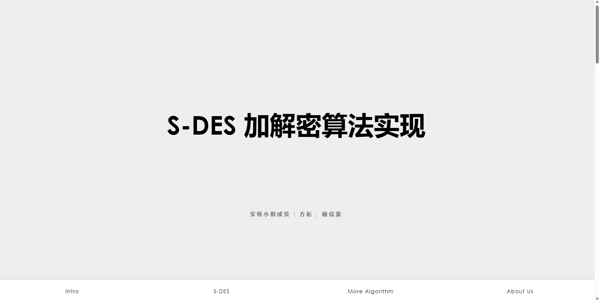
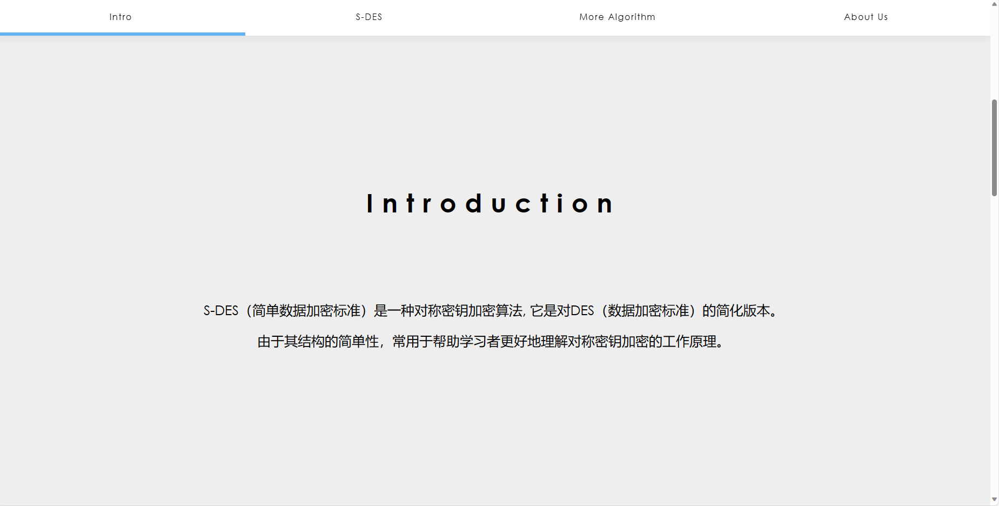
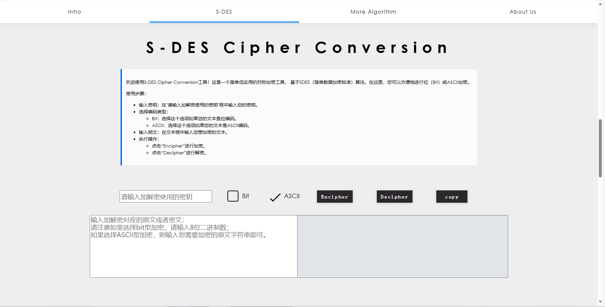
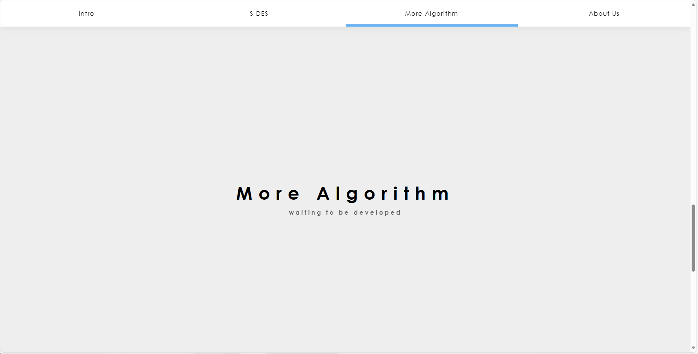
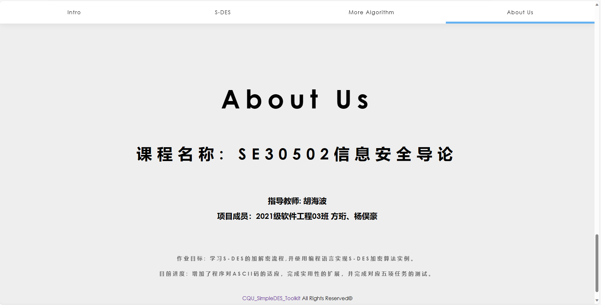
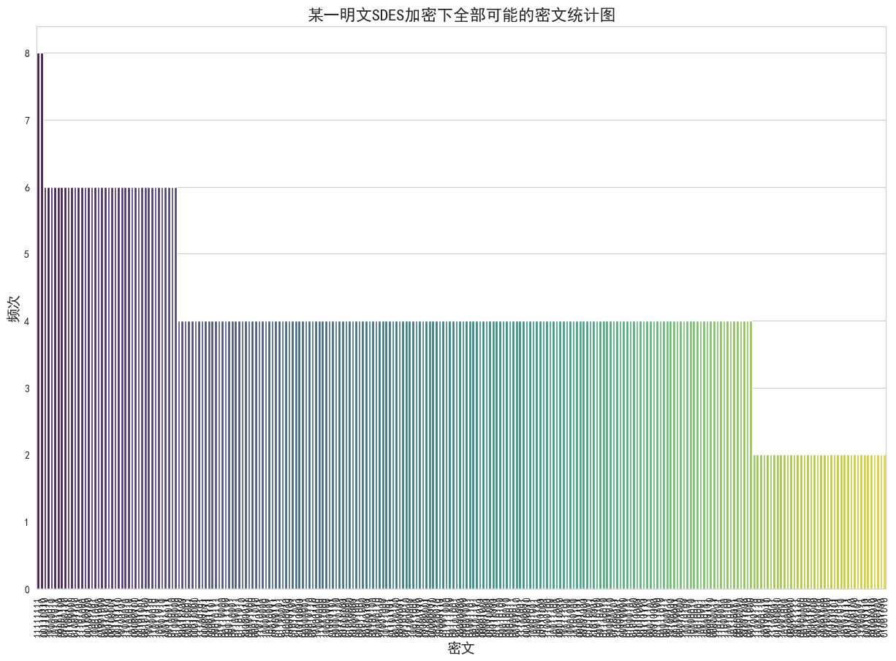

# CQU_SimpleDES_Toolkit
重庆大学大数据与软件学院信息安全导论作业1：S-DES算法实现

### 1. 算法实现

> 我们的S-DES算法实现在`SDES/SDES.py`文件中，其中可以使用到S-DES算法的加密和解密两个函数。 

为了实现良好的代码封装，我们定义了一个SDES的加密类。

- 初始化函数为：`def __init__(self, key, P10, P8, IP, IP_INV, EP, S0, S1, P4):`
  - 其中`key`为10位二进制字符串，`P10`、`P8`、`IP`、`IP_INV`、`EP`、`S0`、`S1`、`P4`为置换表，如果不传入，则使用默认的置换表。
  - 我们设计中将作业要求中的置换表作为默认置换表，因此在实验使用时，可以不传入置换表。
- 定义了：`def permute(self, block, table):`函数，用于实现置换操作。
- 定义了：`def left_shift(self, block, shifts):`函数，用于实现循环左移操作，可以选择移动位数。
- 定义了：`def key_generation(self):`函数，用于生成子密钥。
- 定义了：`def f(self, right, subkey):`函数，轮函数f，负责进行扩展、置换、S盒转换等操作。
- 以及加密函数：`def encrypt(self, plaintext):`和解密函数：`def decrypt(self, ciphertext):`。 

故在使用中我们可以直接实例化SDES类，生成一个加密对象。

对于这个加密类调用`encrypt`和`decrypt`函数就可以进行加密和解密操作。

### 2. GUI设计
> - 我们为了设计一个交互良好的界面，使用了`Django`框架进行GUI设计，设计了一系列的Web网页来实现作业需要的效果。
> - 我们的GUI设计中，主要分为五个页面，分别是`首页（index)`、`介绍（Intro）`、`S-DES`、`更多加密算法`、`关于我们`。

#### 2.1 Overview



上述的视频简单展示了我们的界面设计，可以看到我们的界面设计十分简洁，同时也有良好的交互性。

值得一提的是在加解密部分我们为了方便用户的使用，增加了一键复制的功能，可以帮助用户方便的复制加密后的密文或是解密后的明文。

### 3. 项目下载和Django配置

#### 3.1 项目下载
本项目是一个基于 Django 开发的网页应用，提供 SDES 加密功能。

```shell
git clone https://github.com/FangHeng/CQU_SimpleDES_Toolkit.git
cd CQU_SimpleDES_Toolkit
```

#### 3.2 安装Django

```shell
pip install django
```

#### 3.3 运行项目

```shell
python manage.py runserver
```

#### 3.4 IDE中设配置Configuration

- 在 PyCharm 中，选择 `Run` -> `Edit Configurations`。
- 点击 `+`，选择 `Django Server`。
- 在 `Host` 中填写 `127.0.0.1`。
- 在 `Port` 中填写 `8000`。
- 设置 `Environment variables` 为 `PYTHONUNBUFFERED=1;DJANGO_SETTINGS_MODULE=CQU_SimpleDES.settings`。
- 点击 `OK`。

### 4. 编程和测试要求

#### 4.1 第1关：基本测试

> 根据S-DES算法编写和调试程序，提供GUI解密支持用户交互。输入可以是8bit的数据和10bit的密钥，输出是8bit的密文。
> - 具体详细测试代码请看[task1测试文件夹](https://github.com/FangHeng/CQU_SimpleDES_Toolkit/tree/main/testZone/task1)。

##### 4.1.1 GUI界面中测试

输入可以是8bit的数据和10bit的密钥，输出是8bit的密文：


当输出不符合标准时，返回处理失败的错误：



##### 4.1.2 测试代码中测试

我们在`/testZone/task1`文件夹中提供了jupyter notebook的测试代码，可以直接打开task1测试文件夹中的[task1.ipynb文件](https://github.com/FangHeng/CQU_SimpleDES_Toolkit/tree/main/testZone/task1/task1.ipynb)，即可看到测试结果。

##### 4.1.3 GUI设计

###### 4.1.3.1 Index界面

index界面是程序的首页，包含标题和小组成员信息：



###### 4.1.3.2Intro界面

Intro界面是第二页，也是导航栏中的第一个元素，其简要介绍了课程所需实现的算法：



###### 4.1.3.3 S-DES界面

S-DES界面是本程序的核心界面，负责为用户提供了可供交互的前端GUI。在界面的上半部分提供使用说明，而界面的下半部分接受用户的输入，点击Encipher或者Decipher即完成加解密操作，并可以使用copy一键复制转换结果。



###### 4.1.3.4 More Algorithm界面

More Algorithm界面处于待开发状态，计划将来在此处可以实现其他加密算法的处理和转换逻辑。



###### 4.1.3.5 About Us界面

About Us界面主要介绍课程和项目的相关信息，包含课程名称代码、指导老师和目标进度等等。最后的脚注部分有github项目地址链接和copyright信息。



#### 4.2 第2关：交叉测试

> 考虑到是**算法标准**，所有人在编写程序的时候需要使用相同算法流程和转换单元(P-Box、S-Box等)，以保证算法和程序在异构的系统或平台上都可以正常运行。设有A和B两组位同学(选择相同的密钥K)；则A、B组同学编写的程序对明文P进行加密得到相同的密文C；或者B组同学接收到A组程序加密的密文C，使用B组程序进行解密可得到与A相同的P。
> - 具体详细测试代码请看[task2测试文件夹](https://github.com/FangHeng/CQU_SimpleDES_Toolkit/tree/main/testZone/task2)。

我们在该轮测试中与两个小组进行了交叉测试，验证了我们加密算法的正确性。

我们在`/testZone/task2`文件夹中提供了与两个小组测试的jupyter notebook测试代码，可以直接打开task2测试文件夹中的[task2.ipynb文件](https://github.com/FangHeng/CQU_SimpleDES_Toolkit/tree/main/testZone/task2/task2.ipynb)，即可看到测试结果。

#### 4.3 第3关：扩展功能

> 考虑到向实用性扩展，加密算法的数据输入可以是ASII编码字符串(分组为1 Byte)，对应地输出也可以是ACII字符串(很可能是乱码)。
> - 具体详细测试代码请看[task3测试文件夹](https://github.com/FangHeng/CQU_SimpleDES_Toolkit/tree/main/testZone/task3)。

##### 4.3.1 GUI界面中测试

处理ASCII输入：


当输出不符合标准时，返回处理失败的错误：


##### 4.3.2 测试代码中测试

我们在`/testZone/task3`文件夹中提供了jupyter notebook的测试代码，可以直接打开task3测试文件夹中的[task3.ipynb文件](https://github.com/FangHeng/CQU_SimpleDES_Toolkit/tree/main/testZone/task3/task3.ipynb)，即可看到测试结果。

##### 4.3.3 ASCII码加密时的处理

因为我们常用的字符集仅仅只是0-127位的ASCII码，所以我们在加密时对应的只剩下了7位bit，这并不符合SDES算法的加密要求，我们综合考虑多种方式之后选择了更为全面的Unicode字符集，选取前256作为我们的字符集。

同时ASCII字符在加密后往往会出现乱码或者无法显示的控制符（但是不影响解密，只要正确复制后即可正常解密）。
所以我们在加密ASCII码是采用了显示十六进制的加密结果，而不是对应的Unicode字符，避免了很多无法显示的结果与乱码。
在对应的解密阶段我们也采用了十六进制的解密方式，将十六进制的密文转换为对应的ASCII码，这样就可以避免乱码的出现。

#### 4.4 第4关：暴力破解

> 假设你找到了使用相同密钥的明、密文对(一个或多个)，请尝试使用暴力破解的方法找到正确的密钥Key。在编写程序时，你也可以考虑使用多线程的方式提升破解的效率。请设定时间戳，用视频或动图展示你在多长时间内完成了暴力破解。
> - 具体详细测试代码请看[task4测试文件夹](https://github.com/FangHeng/CQU_SimpleDES_Toolkit/tree/main/testZone/task4)。

为了测试SDES算法的安全性，我们在该轮测试中进行了暴力破解的测试，验证了我们加密算法的安全性。

我们给出了三组明文密文对，并依次对密钥进行了暴力破解.

我们在`/testZone/task4`文件夹中提供了三组明密文对的jupyter notebook测试代码，可以直接打开task4测试文件夹中的[task4.ipynb文件](https://github.com/FangHeng/CQU_SimpleDES_Toolkit/tree/main/testZone/task4/task4.ipynb)，即可看到测试结果。

就结果来看，我们可以通过jupyter中代码框的运行时间来看到，我们的暴力破解算法的运行时间基本在毫秒级，大多在20+ms就可以完成破解，并给出全部的可能的key。

同时我们也发现了每一对明密文对都可能会对应多个可解的key，这在后续第5关会进行详细讨论。

#### 4.5 第5关：封闭测试

>  根据第4关的结果，进一步分析，对于你随机选择的一个明密文对，是不是有不止一个密钥Key？进一步扩展，对应明文空间任意给定的明文分组P_{n}，是否会出现选择不同的密钥K_{i}\ne K_{j}加密得到相同密文C_n的情况？
> - 具体详细测试代码请看[task5测试文件夹](https://github.com/FangHeng/CQU_SimpleDES_Toolkit/tree/main/testZone/task5)。

我们在该轮测试中进行了封闭测试，讨论了SDES算法的安全性。

简化DES（S-DES）是为了教学目的而创建的一种简化版的数据加密标准（DES），其设计目的并不是为了实际应用或实际安全性。但从数学和信息理论的角度来看，导致密钥碰撞的原因通常可以归结为以下几点：

- 有限的输出空间：如果加密算法的输出空间（即可能的密文空间）小于其输入空间（明文和密钥的组合），那么必然存在多个输入映射到同一个输出，导致碰撞。 
- 非完美的置换：理想的加密算法将为每一个不同的密钥提供一个完全不同的明文到密文的映射。但是，如果某些密钥产生的映射相同或相似，就可能发生密钥碰撞。 
- 固有的冗余：当使用某些加密方法（如S-盒、置换等）时，如果这些方法内部包含冗余或对称性，那么不同的输入可能会导致相同的输出。 
- 简化的结构：S-DES与真正的DES相比具有简化的结构，这意味着其加密过程没有充分混淆明文和密钥，从而更容易出现不同的明文和密钥组合导致相同的密文输出。 
- 小密钥空间：S-DES只有10位密钥，意味着只有2^10 = 1024 种可能的密钥。这样的小密钥空间使得碰撞更为可能。

详细的证明和讨论我们放在了`/testZone/task5`文件夹中的[task5.ipynb文件](https://github.com/FangHeng/CQU_SimpleDES_Toolkit/tree/main/testZone/task5/task5.ipynb)，即可以看到详细的讨论过程以及数学推导。

同样的，我们针对对应明文空间任意给定的明文分组P_{n}，是否会出现选择不同的密钥K_{i}\ne K_{j}加密得到相同密文C_n的情况也进行了检测，得到了肯定的结果。在jupyter文件中也进行了一定的讨论。

每个明文在用全部1024个可能的密钥加密后只会产生254个密文，并且统计结果相似：



我们可以探讨一下原因：

- S盒的非线性。如前所述，S盒是SDES中的非线性组件。当我们在所有可能的密钥上尝试相同的明文时，可能会遇到多个密钥导致S盒的相同输出。即使我们改变密钥，由于S盒的非线性特性，其输出可能仍然相同。 
- 重叠扩展置换。在SDES中，有一个扩展置换（EP）,它会将4位的输入扩展到8位。这个扩展不是简单地增加更多的信息，而是重复某些位。这意味着当这些位参与到与密钥的XOR操作中时，某些密钥位会影响到重叠的位。因此，不同的密钥可能会导致加密过程中的这些重叠位的相同结果。 
- 密钥调度。在SDES中，生成两个子密钥的过程涉及到置换和循环左移。这可能导致不同的10位密钥产生相同的8位子密钥。

详细的证明和讨论我们放在了`/testZone/task5`文件夹中的[task5.ipynb文件](https://github.com/FangHeng/CQU_SimpleDES_Toolkit/tree/main/testZone/task5/task5.ipynb)，即可以看到详细的讨论过程以及数学推导。

这样的实验过程也加深了我们对于该加密算法的理解和认识。

---
**至此，我们完成了全部S-DES加密算法的实现、GUI界面的设计，以及要求中提到的五个任务。较好的完成了本次实验。**